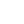

  

   

  

    

  
  
  
  

    

  
  
  

 

## 👨‍💻 About Me

<b>Building AI-integrated core workflows, not AI bolted on afterward.</b>

I'm Alfiz Ilham — a Fullstack Developer focused on AI-integrated apps, and a Computer Engineering student at Universitas Syiah Kuala. Instead of adding AI as a feature at the end, I embed it directly into backend logic and automation pipelines — from n8n workflows to custom RAG architectures with pgvector.

<ul>
  <li>🎓 <b>Education:</b> B.S. Computer Engineering, Universitas Syiah Kuala</li>
  <li>💻 <b>Current Role:</b> Freelance Fullstack Developer (AI-Integrated Apps)</li>
  <li>✍️ <b>Also:</b> Freelance Calligrapher (Naskh script & Mushaf illumination, 500+ commissions)</li>
  <li>⚡ <b>Core Focus:</b> Web Systems, AI Workflows & Automation</li>
</ul>

 

## 🚀 Featured Projects

<table border="0">
  <tr>
    <td width="70%">
      <b>🤖 <a href="https://github.com/alfzilham/AlfizIlham-Portfolio">AlfizIlham-Portfolio</a></b> 
      Bilingual portfolio site with a built-in AI chatbot powered by semantic RAG (pgvector + OpenRouter embeddings).
    </td>
    <td width="30%" align="right" valign="middle">
      
      
    </td>
  </tr>

  <tr><td colspan="2">
</td></tr>

  <tr>
    <td width="70%">
      <b>🔄 <a href="https://github.com/alfzilham/FlowGram">FlowGram</a></b> 
      Visual, node-based workflow builder with a drag-and-drop infinite canvas and Neon PostgreSQL cloud sync.
    </td>
    <td width="30%" align="right" valign="middle">
      
      
    </td>
  </tr>

  <tr><td colspan="2">
</td></tr>

  <tr>
    <td width="70%">
      <b>📈 <a href="https://github.com/alfzilham/PersonalHabitTracker">PersonalHabitTracker</a></b> 
      All-in-one productivity tracker with an in-app AI assistant powered by the OpenRouter API.
    </td>
    <td width="30%" align="right" valign="middle">
      
      
    </td>
  </tr>

  <tr><td colspan="2">
</td></tr>

  <tr>
    <td width="70%">
      <b>📲 WhatsApp AI Message Filter</b> 
      Webhook-triggered filtering system built with n8n, WAHA, and OpenRouter vision AI analysis.
    </td>
    <td width="30%" align="right" valign="middle">
      
      
    </td>
  </tr>
</table>

 

## 🛠️ Technologies & Skills

**Languages & Core Frontend**

&nbsp;&nbsp;
&nbsp;&nbsp;
&nbsp;&nbsp;
&nbsp;&nbsp;
&nbsp;&nbsp;
&nbsp;&nbsp;
&nbsp;&nbsp;

&nbsp;&nbsp;
&nbsp;&nbsp;
&nbsp;&nbsp;
&nbsp;&nbsp;
&nbsp;&nbsp;
&nbsp;&nbsp;
&nbsp;&nbsp;
&nbsp;&nbsp;
&nbsp;&nbsp;

**Backend, Databases & Cloud**

&nbsp;&nbsp;
&nbsp;&nbsp;
&nbsp;&nbsp;
&nbsp;&nbsp;
&nbsp;&nbsp;
&nbsp;&nbsp;
&nbsp;&nbsp;
&nbsp;&nbsp;
&nbsp;&nbsp;
&nbsp;&nbsp;
&nbsp;&nbsp;
&nbsp;&nbsp;
&nbsp;&nbsp;

**AI Engineering & Workflow Tools**

&nbsp;&nbsp;
&nbsp;&nbsp;
&nbsp;&nbsp;
&nbsp;&nbsp;
&nbsp;&nbsp;
&nbsp;&nbsp;
&nbsp;&nbsp;
&nbsp;&nbsp;
&nbsp;&nbsp;
&nbsp;&nbsp;

<b>MCP</b> · <b>Amazon Bedrock</b> · <b>Vertex AI</b> — not available as monochrome icons, shown as badges below

  
  
  

**Design & Creative Tools**

&nbsp;&nbsp;
&nbsp;&nbsp;

<b>Adobe Photoshop</b> · <b>Adobe Lightroom</b> · <b>Canva</b> · <b>CalliPro</b> — not available as monochrome icons, shown as badges below

  
  
  
  

 

## 📊 GitHub Activity & Stats

  

 

  💡 Currently exploring: AI Agentic Tools · MCP Workflows · Retrieval-Augmented Generation

