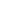

  

   

  

  

  
  
  
  

  

  
  
  

 

## 👨‍💻 About Me

<b>Building AI-integrated core workflows, not AI bolted on afterward.</b>

I'm Alfiz Ilham — a Fullstack Developer focused on AI-integrated apps, and a Computer Engineering student at Universitas Syiah Kuala. Instead of adding AI as a feature at the end, I embed it directly into backend logic and automation pipelines — from n8n workflows to custom RAG architectures with pgvector.

<ul>
  <li>🎓 <b>Education:</b> B.S. Computer Engineering, Universitas Syiah Kuala</li>
  <li>💻 <b>Current Role:</b> Freelance Fullstack Developer (AI-Integrated Apps)</li>
  <li>✍️ <b>Also:</b> Freelance Calligrapher (Naskh script & Mushaf illumination, 500+ commissions)</li>
  <li>⚡ <b>Core Focus:</b> Web Systems, AI Workflows & Automation</li>
</ul>

 

## 🛠️ Technologies & Skills

**Languages & Core Frontend**

&nbsp;&nbsp;
&nbsp;&nbsp;
&nbsp;&nbsp;
&nbsp;&nbsp;
&nbsp;&nbsp;
&nbsp;&nbsp;
&nbsp;&nbsp;

&nbsp;&nbsp;
&nbsp;&nbsp;
&nbsp;&nbsp;
&nbsp;&nbsp;
&nbsp;&nbsp;
&nbsp;&nbsp;
&nbsp;&nbsp;
&nbsp;&nbsp;
&nbsp;&nbsp;

**Backend, Databases & Cloud**

&nbsp;&nbsp;
&nbsp;&nbsp;
&nbsp;&nbsp;
&nbsp;&nbsp;
&nbsp;&nbsp;
&nbsp;&nbsp;
&nbsp;&nbsp;
&nbsp;&nbsp;
&nbsp;&nbsp;
&nbsp;&nbsp;
&nbsp;&nbsp;
&nbsp;&nbsp;
&nbsp;&nbsp;

**AI Engineering & Workflow Tools**

&nbsp;&nbsp;
&nbsp;&nbsp;
&nbsp;&nbsp;
&nbsp;&nbsp;
&nbsp;&nbsp;
&nbsp;&nbsp;
&nbsp;&nbsp;
&nbsp;&nbsp;
&nbsp;&nbsp;
&nbsp;&nbsp;

<b>MCP</b> · <b>Amazon Bedrock</b> · <b>Vertex AI</b> — not available as monochrome icons, shown as badges below

  
  
  

**Design & Creative Tools**

&nbsp;&nbsp;
&nbsp;&nbsp;

<b>Adobe Photoshop</b> · <b>Adobe Lightroom</b> · <b>Canva</b> · <b>CalliPro</b> — not available as monochrome icons, shown as badges below

  
  
  
  

 

## 📊 GitHub Activity & Stats

  

 

  💡 Currently exploring: AI Agentic Tools · MCP Workflows · Retrieval-Augmented Generation

 

## 🐍 Contribution Snake

  <picture>
    <source media="(prefers-color-scheme: dark)" srcset="https://raw.githubusercontent.com/alfzilham/alfzilham/output/github-snake-dark.svg" />
    <source media="(prefers-color-scheme: light)" srcset="https://raw.githubusercontent.com/alfzilham/alfzilham/output/github-snake.svg" />
    
  </picture>

 

## 📊 Profile Summary

  

  
  

  
  

 

## 🚀 About Me

<table>
  <tr>
    <td width="60%" valign="top">
      

        Currently exploring AI-integrated backend systems, agentic workflows, and retrieval-augmented generation (RAG) with pgvector. I enjoy turning ideas into working products, automating repetitive processes with n8n, and refining my craft in both code and calligraphy.
      

      <ul>
        <li>🌍 Based in Aceh Besar, Indonesia</li>
        <li>🤖 Building AI-integrated apps and automation pipelines</li>
        <li>📬 You can reach me at <a href="mailto:alfizilham@gmail.com">alfizilham@gmail.com</a></li>
        <li>🧠 Currently learning advanced RAG architectures and MCP workflows</li>
      </ul>
    </td>
    <td width="40%" valign="top" align="center">
      
    </td>
  </tr>
</table>
